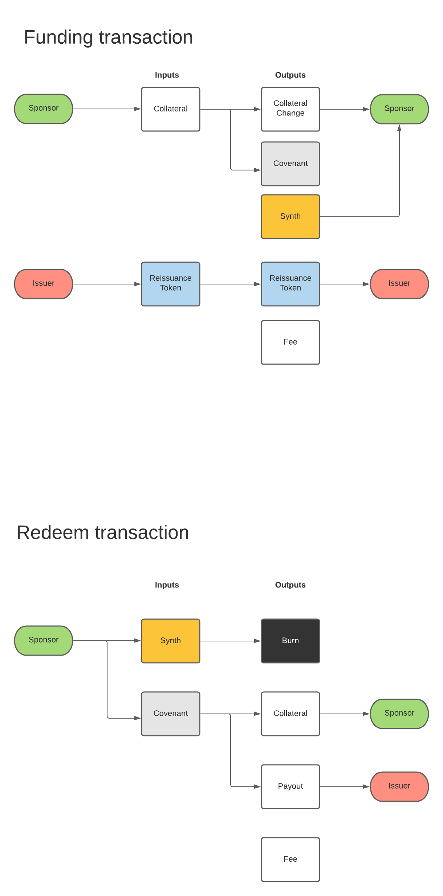
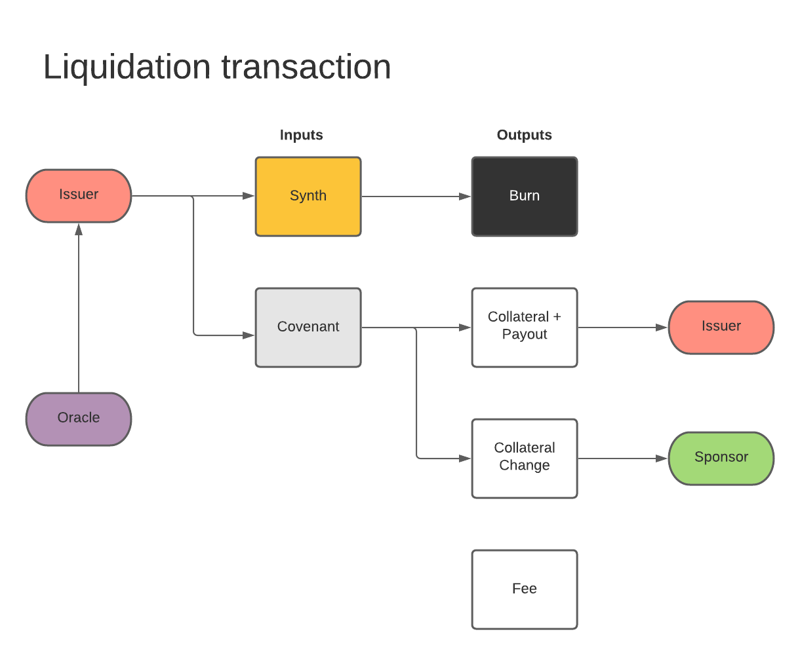

# Synthetic asset smart contract for the Liquid network

Synthetic assets are collateral-backed assets whose value fluctuates depending on a reference price. We propose a scheme where anyone can lock collateral on the Liquid Network to issue assets that track the price of a chosen real-world asset, such as dollars or stocks. The Elements enhanced scripting capabilities allow non-interactive redemption and liquidation when the collateral's value is underwater, with the possibility to top up the collateral to prevent liquidation.

Detailed description document is published with each [release](https://github.com/vulpemventures/synthetic-asset-smart-contract/releases).

## `TL;DR`

### Actors

- Issuer/Liquidator
- Sponsor
- Oracle

### Flow

1. **Issuer** mints an asset with zero supply (ie. `sTSLA`)
2. **Sponsor** locks collateral (ie. `USDt`) in the contract to mint the asset at the current reference price upon mutual agreement on liquidation target.
3. If the collateral's value is underwater, **Issuer** can liquidate after burning the asset and presenting Oracle's signature on the reference price.
4. **Sponsor** can prevent liquidation via collateral top-up in collaboration with the  **Issuer** to create a new contract.

NOTICE: **Sponsor** can always redeem in a non-interactive fashion his collateral burning the asset and sending a payout fee to the **Issuer**.

## How it works

